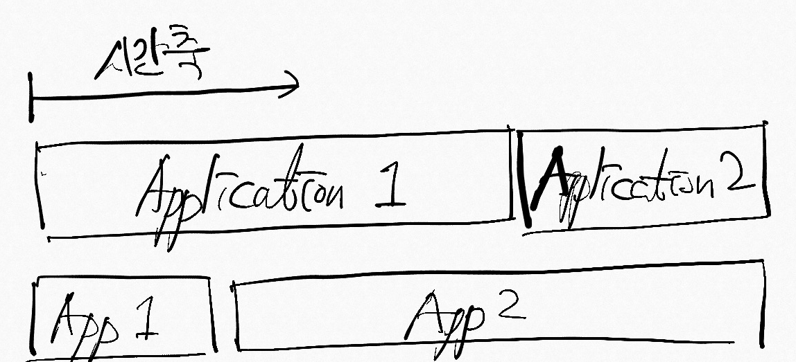
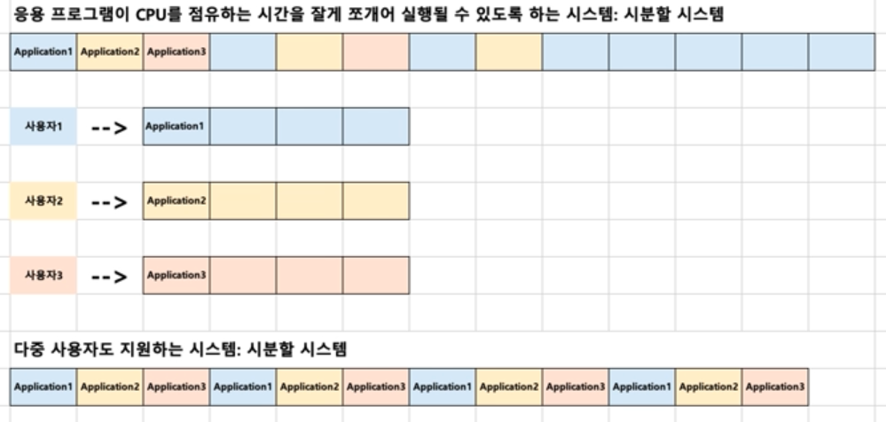
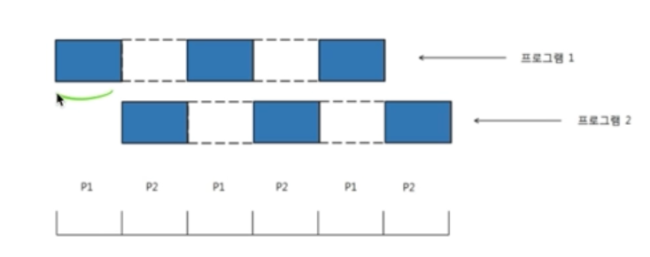
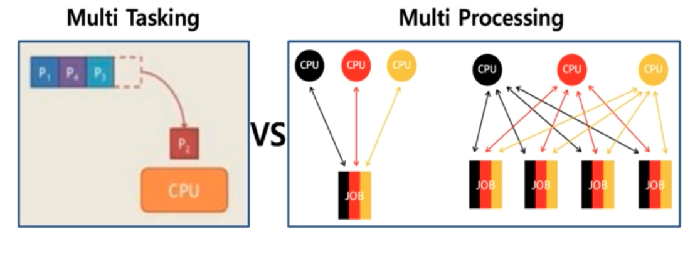

# 프로세스 스케쥴링
## 배치 처리 시스템, 시분할 시스템, 멀티 프로그래밍(태스킹)

### Batch Processing (배치 처리 시스템)
시간에 따라서 자동으로 다음 응용 프로그램이 실행될 수 있도록 하는 시스템

=> 자료구조의 Queue 방식과 비슷

### 배치 처리 시스템과 시분할 시스템/멀티 프로그래밍

왜 배치 처리 시스템이 안쓰이고 시분할 시스템과 멀티프로그래밍이 쓰이게 됐을까 ?  
=> "여러 프로그램을 순차적으로 실행될 수 있도록 해주세요"  
  * 어떤 프로그램은 실행시간이 너무 많이 소요돼서, 다른 프로그램이 실행되는데 많은 시간을 기다려야 한다.  
  * "나는 MP3 음악을 들으면서, 문서작성을 하고 싶어요" (동시에 여러 응용프로그램 실행) => 배치 처리 시스템에선 불가능한 일  
  * "여러 사용자가 동시에 하나의 컴퓨터를 쓰려면 어떻게 해야 하나요 ?" (다중사용자 지원)  
  
  => 이러한 이유들로 시분할/멀티 프로그래밍이 나왔다.
  

### 시분할 시스템
* 다중 사용자 지원을 위해 컴퓨터 응답 시간 (like Keyboard) 을 최소화하는 시스템  
* 시간을 잘게 분할해서, 응용 프로그램을 조금씩 조금씩 사용

### 멀티 프로그래밍(태스킹)
* 단일 CPU 에서 여러 응용 프로그램이 **동시에 실행되는 것처럼** 보이도록 하는 시스템
* 단일 CPU 에서는 어쩔 수 없이 어플리케이션이 하나밖에 실행이 안되기 때문에, "처럼 보이게" 하는 것. (마치 동시에 실행되는 것처럼)
 => 사람이 인지할 수 없을 정도로...
* 예를 들어, 음악을 들으며 문서 작성을 한다.

#### 실제 멀티 태스킹
* 1000ms = 1초, 1ms = 0.001초
* 10 ~~ 20 ms 단위로도 실행 응용 프로그램이 바뀐다.
* 사용자에게는 동시에 실행되는 것처럼 보이게 됨.

### 멀티 태스킹과 멀티 프로세싱
* 멀티 태스킹 : 단일 CPU
* 멀티 프로세싱 : 여러 CPU 라고 일단 생각.
  * 하나의 응용프로그램이 여러 CPU 를 사용하며, 어떻게 하면 빨리 할 수 있을까라는 고민점에서 나온 것
  * **"여러개의 프로세서가 서로 협력적으로 일을 처리하는 것, 병렬로 처리하는 것"**

